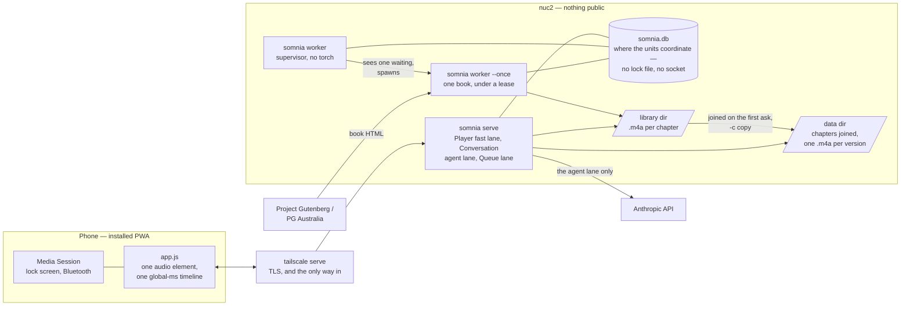
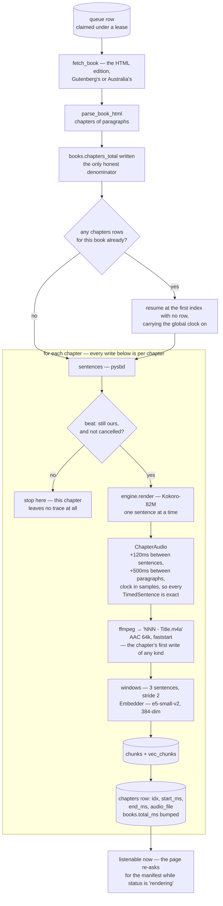
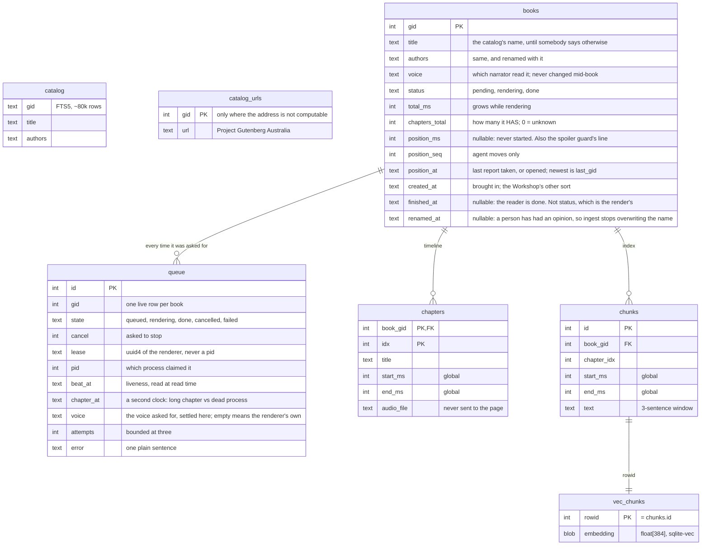
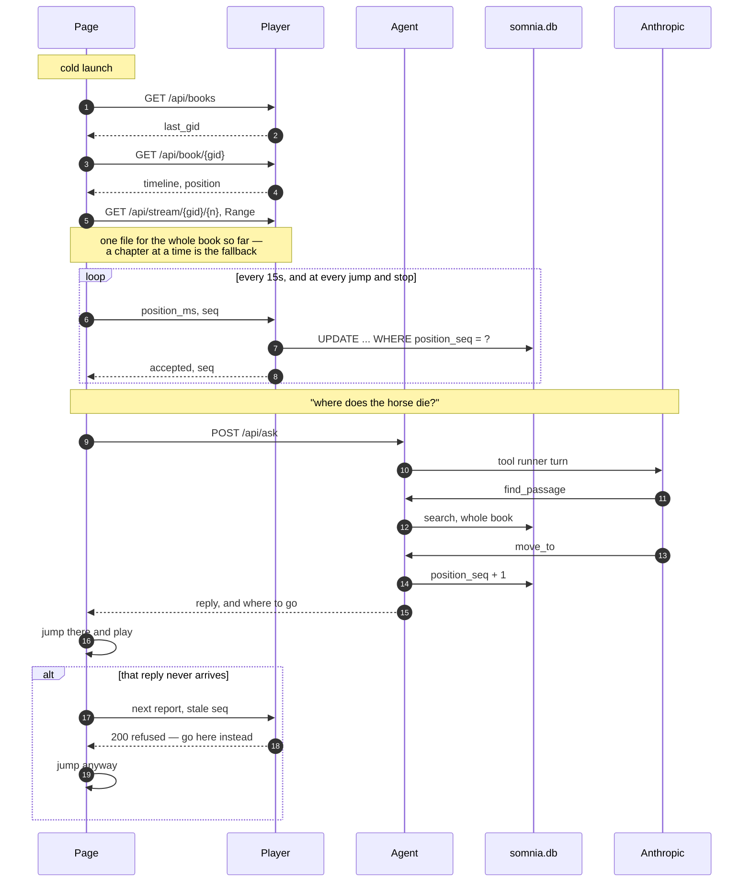
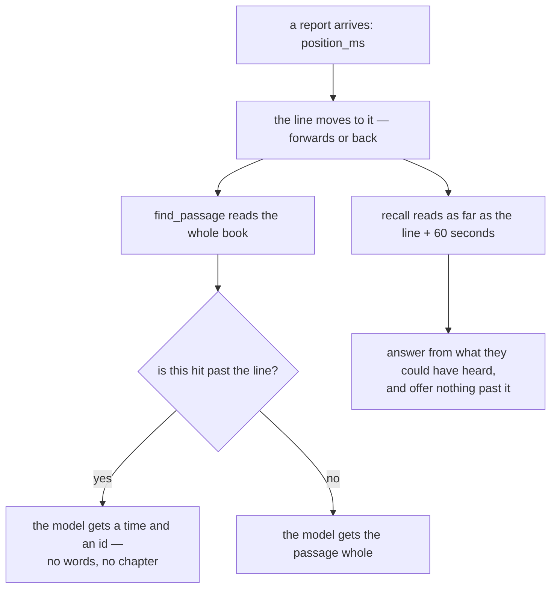

# Architecture

What the pieces are and how a night flows through them. This is the map;
[design.md](design.md) is the argument for why the map looks like this, and the
[ADRs](decisions.md) record the turns that were taken.

## The shape of it

somnia renders public-domain books to audio itself, and that one decision pays
for everything else. Because the renderer placed every sentence, it knows
exactly which span of audio each sentence occupies — so the text/audio index is
free, and a question at 2am can be answered with a timestamp rather than a
guess.

Three things run. The two on the box share one sqlite file and the audio on
disk; the third is on the phone and reaches both over HTTP:

- **the renderer** (`somnia worker`) — a supervisor that takes one book at a
  time off the queue and spawns a child to turn a Gutenberg id into per-chapter
  m4a files plus a semantic index, streaming chapter by chapter
- **the server** (`somnia serve`) — serves the page, the audio, the catalog,
  the queue and the agent
- **the page** (the installed PWA) — plays the book, picks the next one, and
  carries the conversation

The renderer is a separate unit from the server on purpose, and
[ADR 5](decisions/0005-render-one-book-at-a-time.md) has the argument:
restarting the page's process, which is what a deploy is, must not kill a
render, and Kokoro must never compete with a seek for two cores.

Nothing leaves the box but the model calls and the book being fetched, and the
player waits on neither: the sound comes off the disk beside it and where they
have got to is a row in the file the two units share. There is no other server
for a night to be held up by.

Asking for a book — from the panel or by voice — writes a queue row and nothing
else, so the answer comes back at once and the render happens in the other unit
entirely, minutes or hours later. That is how a book gets added at 2am without
anything waiting for it — and how two books asked for a minute apart cannot
both be rendering, because the worker claims one at a time and the claim is a
single guarded UPDATE.

There is no login anywhere. Reachability *is* the authentication: the server
binds to localhost, and only `tailscale serve` can reach the port. The box it
runs on joins the tailnet **tagged**, and the ACL never lists that tag as a
source, so it can be reached by personal devices and can never initiate a
connection into the tailnet.

## One clock

Every timestamp in somnia — index hit, chapter mark, saved position, what the
page shows — is **global milliseconds from the start of the
book**. It is the render clock, counted in PCM samples before encoding, and
never what a decoder reports: summing durations off the files drifts tens of
milliseconds a chapter and is a second out by chapter forty.

The page converts between that clock and the clock of whatever the audio element
is actually holding, in four small functions, and that is the only place the
split exists. When the element holds the whole book joined into one file — the
ordinary case, and the reason a chapter boundary no longer takes the lock screen
down ([ADR 7](decisions/0007-cross-a-chapter-without-letting-go.md)) — the
conversion is the identity, measured on the real forty-nine chapter book rather
than assumed. When it holds a single chapter, which is the fallback, the
conversion is `(chapter index, seconds into this file)`. Either way "back a bit"
from the start of chapter five lands in chapter four, the way a listener means
it.

## Making a book

Asking for a book writes a row into `queue` and returns.

Two things ask. The agent, in a sentence, when somebody says a title out loud;
and the page's own panel, which searches the catalog on disk, offers a voice,
and posts a gid. Both end in the same `queue.submit` and both get the same
sentence back, so the page and the voice cannot disagree about what just
happened.

The worker claims the oldest waiting row — while nothing else holds a live
lease — and spawns a child that streams it: each chapter is written into the
library folder and indexed the moment it finishes, so listening can start
minutes after picking a book while the rest arrives overnight.

Rendering per **sentence** rather than per chunk or per paragraph is what makes
the timestamps exact by construction, and it is why the engine is swappable:
anything that can render one sentence satisfies the `TTSEngine` protocol. It is
also where a stop is allowed to happen, and nowhere else: a chapter is encoded
on the last line of rendering it, so a render stopped between sentences leaves
no m4a, no chunks and no chapters row for the chapter it was in — which is what
makes the window between indexing a chapter and writing its row unreachable,
and therefore what makes cancelling and resuming safe at all.

Never re-render a book with a different engine or voice. Durations change, and
every timestamp — every index entry, every chapter mark, and the position they
went to sleep at — is invalidated. Which voice a book gets is therefore settled
once, on the queue row, at the moment somebody asks for it; the renderer prefers
that, then the voice already on the book, then its own configuration, so neither
a deploy nor a resume can change a narrator half way through.

Each chapter opens by saying what it is — *Chapter 12. The Invisible Man* — and
that line is built from the heading rather than being the heading: roman
numerals are converted, capitals are taken out, and a heading with no number in
it is spoken without one, because somnia's chapter *index* counts what the
parser found and is not what the book calls the chapter. It is rendered before
the first sentence's clock is read, so it costs the timestamps nothing, and it
is deliberately not indexed — it is not the book's text.

## What is stored

One sqlite file holds all of it: the catalog for browsing, the books and their
chapter timelines, the indexed text windows, and the vectors.

`queue` has no foreign key to `books`, and that is not an oversight: a book is
asked for before it exists, and its `books` row is not written until the parse
finishes. A partial unique index on `gid` over the waiting and rendering states
is what keeps one live job per book — enforced by the database rather than by a
check that two presses a millisecond apart would both pass.

A book is a few thousand windows, so brute-force exact nearest-neighbour search
is milliseconds. No database server, no shared infrastructure. The file is in
WAL mode because several writers exist — an agent turn, the player, the queue
panel, the worker, and a render running in another process entirely — and a
reader must never block on any of them. That the render is in another process
is also why the queue lives in this file rather than in a lock file or a
socket: sqlite is the one thing every process in somnia already shares, so a
render's progress and the request to stop it need no channel of their own.

`chunks` earns a second job it was not designed for: because its rows are
overlapping windows taken every second sentence, a window start is always a
sentence start. That is how the page's long rewind lands on the beginning of a
sentence rather than the middle of a clause.

## A night

Serving audio and answering questions are separate lanes. A model turn blocks
for tens of seconds on the API and on the embedder, and a seek must never queue
behind it — a dead player while a question is being answered is exactly the
moment the phone gets put down. So `Player` has its own sqlite connection and
its own lock, and shares nothing with a conversation but the file on disk.

The queue panel is a third lane in the same shape, and it is the same argument a
second time: a submit button that sits there for twenty seconds because somebody
happened to ask a question is exactly the dead control this arrangement exists
to refuse.

The asymmetry in step 7 is the whole protocol. `position_seq` counts **agent
moves and nothing else**; the page's own reports leave it alone. So a report
carrying a stale count can only mean the agent moved the book, and the refusal
that comes back is also where to go instead. That is why a refusal is a 200
with a body rather than a 409: the last report of the night is a `sendBeacon`,
and a beacon can read nothing else.

Only the player and an agent move may write those four columns; what ingest may
touch is in [design.md](design.md).

## How far a question may see

The spoiler guard is bounded by **where the book is**, and by nothing else. One
column, written by the page's own reports and by an agent move, read by every
search and by the one route that hands back book text.

It was a high-water mark until [ADR
10](decisions/0010-draw-the-line-where-they-are.md), raised only over ground the
sound had really covered — which every report had to prove by counting its own
playback off the media clock, against a wall-clock ceiling and five seconds of
slack. It could not be made to work: a report standing further past the mark
than it had playback to show for could not be credited, and every report after
a forward skip is such a report, so one press of +30 stopped the mark for the
rest of the book. [design.md](design.md) argues what replaced it and what that
gives up.

The line bounds what is *said*, not what may be found. The agent may answer a
question about a book out of what it already knows of it, as far as that line
and no further ([ADR 6](decisions/0006-answer-a-question-about-the-book.md)) —
and it is never handed the words of a passage past it, so there is nothing there
to be careless with ([ADR 11](decisions/0011-the-guard-belongs-on-the-row.md)).
The question tool, `recall`, is the one that stops at the line when it reads,
because prose has no press in front of it; it also marks the turn so that
`move_to` and `offer_positions` refuse — a question must not cost the listener
their place.

## What the page has to survive

Three things nothing absorbs on the page's behalf, and there is nothing else
left to absorb them. All three end the same way if unhandled — silence, under a
notification that says paused — and none can be seen without unlocking the
phone, so each also says what is happening on the status line.

| What happens | What the page does |
|---|---|
| The book grows while it is playing | Re-asks for the manifest while `status` is `rendering` — when the audio runs out, and when the app comes back in front of them — backing off from 5s to a minute. Only the timeline is adopted; the position in the answer is its own report come back late. |
| The tailnet drops for a few seconds | Reassigns `src` to reload whatever it is holding — the joined book, or a chapter in the fallback — *from where they had got to*, on a ladder from 2s to 30s. Every route to a reload uses that ladder, including a stall that never raises an error. It stops entirely when they were the ones who stopped it. |
| The page is discarded | The conversation is meant to die — it is keyed in `sessionStorage`. An armed sleep timer is not, so it is written to `localStorage` as it counts down and restored with the minutes it had left, unless it is more than six hours old. |

Most of the transport is not on the page at all. With the screen off the book
is driven from the lock screen, the notification shade and whatever is paired
over Bluetooth, all arriving through the Media Session API. The scrubber
published there is chapter-scale on purpose: a whole-book scrubber on a
twelve-hour novel gives three minutes to the pixel, and one sleepy thumb would
fling them past the spoiler guard into the ending.

## The modules

| Module | Job |
|---|---|
| `catalog` | Both libraries' published lists in one FTS5 table — browsing is offline, with no third-party API |
| `pgau` | Project Gutenberg Australia's plain-text index, and the offset ids that keep it out of Gutenberg's way |
| `gutenberg` | Fetch the HTML edition, parse it into chapters of paragraphs |
| `segment` | Sentences (pysbd), and the overlapping windows the index is built from |
| `announce` | The line a chapter opens with, built from the heading rather than being it |
| `tts` | The `TTSEngine` protocol, and Kokoro-82M behind it |
| `voices` | The six voices a book may be read in, kept out of `tts` so the process answering the page need not import torch |
| `audio` | Accumulate a chapter's samples, track the clock, encode via ffmpeg |
| `embed` | e5-small-v2, with the asymmetric `query:` / `passage:` prefixes |
| `index` | Store chunk embeddings; search one book, optionally bounded |
| `ingest` | The streaming pipeline that joins all of the above — resumable, stoppable |
| `queue` | The ingest queue as pure functions: submit, claim, beat, stop, reconcile |
| `worker` | The supervisor and the one-book child that holds the lease |
| `db` | The schema, the migrations, the one-off repairs, WAL, and loading sqlite-vec |
| `tools` | Everything the agent can do, as a plain library with no Anthropic import |
| `agent` | The system prompt and the tool-runner loop |
| `player` | The fast lane: manifest, audio files, position reports |
| `library` | The daytime verbs: take a book away for good, mark it finished, say what it is called |
| `stream` | The chapters joined into one file per version, so a boundary touches nothing |
| `server` | Starlette routes, conversation storage, the mounted page |
| `config` | Where everything is and what it is set to, from the environment |
| `web/` | The PWA: `index.html`, `app.js`, `sw.js`, the manifest and icons |

## The HTTP surface

Everything the page fetches sits under `/api/`, which is not cosmetic: it is
how the service worker knows what never to cache, and it keeps these routes
ahead of the static mount that would otherwise swallow them.

Which lane a route belongs to is the same split as everywhere else: `/api/ask`
and `/api/forget` are the agent's, the manifest, the audio and the position
reports are the player's, and the catalog, the voices and the queue are the
third's. What each one answers is in [the HTTP reference](../reference/http.md);
`/` is the page itself, served straight off the installed package.

A chapter or a stream is named by a book and a number, never by a path. A
chapter's file comes from its `chapters` row and is refused if it resolves
outside the library directory; a stream's name is two integers under the data
directory, and it is built only from chapters that passed that same check. That
is the whole traversal defence, and it has to be, because the server has no auth
by design.
